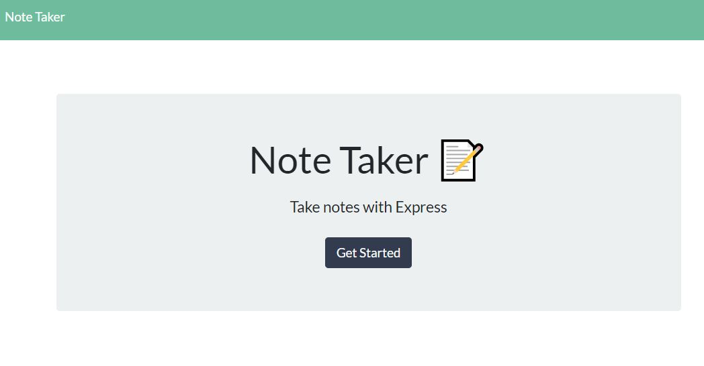
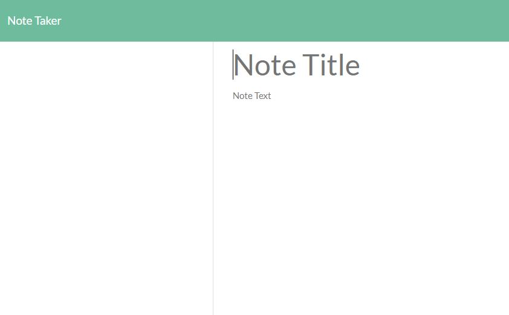

# Note-Taker

Homework  Unit 11

## Description

Create, save, and delete notes with a simple note taker app!

## Tech Used
Express
Javascript
Node.js

## Installation

Open project directory, then npm install to install all dependencies

## Usage

1. node server.js
2.  navigate to localhost:3000
3.  Click "Get Started"
4.  Give the note a title and a body, then press save.
5.  To create a new note, click on the pencil icon
6.  View notes on the left-hand side. Click the red "X" to delete the note

## Links

[drewski419.github.io/Note-Taker](https://drewski419.github.io/Note-Taker/)

[limitless-wildwood-29494.herokuapp.com](https://limitless-wildwood-29494.herokuapp.com/)

